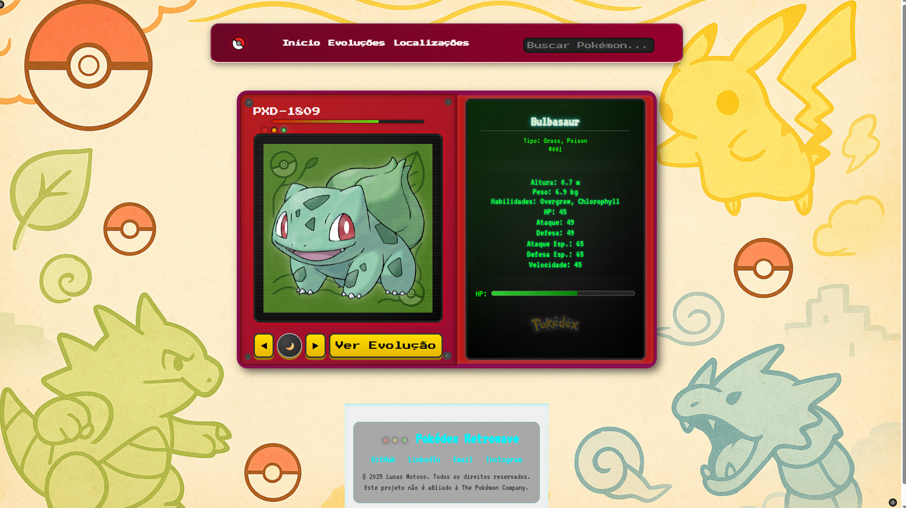

# 📟 Pokédex Retrowave

Uma Pokédex interativa e estilizada com estética retrô-futurista, construída com HTML, CSS e JavaScript puros. Este projeto consome dados da [PokéAPI](https://pokeapi.co/) para exibir informações dinâmicas de Pokémon, suas evoluções e localizações no mapa.

> 🎮 Estilo visual inspirado em um terminal sci-fi dos anos 80 com LEDs, Pokébolas e efeito retrô. Totalmente responsivo, com suporte a modo claro/escuro.

---

## 📸 Preview

  
*A interface exibe animações, transições de tema, parallax e interações com elementos do universo Pokémon.*

---

## 🧩 Funcionalidades

### 🔍 Pokédex (index.html)
- Busca com **autocomplete**.
- Visualização dos dados principais do Pokémon.
- Botão para acessar a **árvore de evolução**.
- Suporte a modo claro e escuro com **background dinâmico**.

### 🧬 Evoluções (evolucoes.html)
- Visualização interativa da linha evolutiva.
- Estilo inspirado em **computador de laboratório sci-fi**.
- Ramificações de evolução (ex: Eevee) suportadas.
- Botão para retornar à Pokédex ou abrir outras evoluções.

### 🌍 Localizações (localizacoes.html)
- Busca de Pokémon por nome e exibição de **localizações** no mapa.
- Ao clicar em uma localização, exibe os **outros Pokémon** encontrados no mesmo local.
- Background com **efeito parallax** simulando um mapa-múndi Pokémon.
- Barra de pesquisa com **sugestões automáticas**.
- Redirecionamento para Pokédex ao clicar em um Pokémon.

---

## 💻 Tecnologias Utilizadas

- **HTML5** sem frameworks
- **CSS3** com responsividade, dark mode, animações e estética retrô
- **JavaScript Vanilla** (ES6+)
- **PokéAPI** – Fonte de dados

---

## 🗂️ Estrutura do Projeto

```bash
├── index.html               # Pokédex principal
├── evolucoes.html           # Página de evolução
├── localizacoes.html        # Página de habitats
├── styles.css               # Estilo global e Pokédex
├── styles-evolucao.css      # Estilo da página de evoluções
├── styles-localizacao.css   # Estilo da página de localizações
├── script.js                # Script da Pokédex principal
├── script-evolucao.js       # Script da árvore de evoluções
├── script-localizacao.js    # Script do mapa de habitats
└── imagens/
    ├── logo-pokedex.png
    ├── background1.png       # Modo claro
    ├── background2.png       # Modo escuro
    └── mapa-mundi.png        # Mapa das localizações
⚙️ Como Executar
Clone o repositório:

bash
Copiar
Editar
git clone https://github.com/lucasmotoso/pokedex-retrowave.git
cd pokedex-retrowave
Abra o arquivo index.html com seu navegador preferido.

💡 Nenhuma dependência ou instalação adicional é necessária. O projeto é 100% client-side.

📱 Responsividade
O layout se adapta automaticamente a telas de celular, tablets e desktops.
Em dispositivos menores, o menu principal se transforma em um ícone hamburger funcional com escamoteamento suave.

🔐 Aviso Legal
Este projeto é apenas para fins educacionais e de portfólio.

Pokédex Retrowave não é afiliado, endossado nem patrocinado pela The Pokémon Company, Nintendo, Game Freak ou Creatures Inc. Todos os direitos sobre os personagens e marcas pertencem aos seus respectivos proprietários.

📬 Contato
Desenvolvido por Lucas Motoso

🧠 Inspiração
Inspirado nas interfaces de computadores retrô dos anos 80 e 90, este projeto busca unir nostalgia e interatividade para criar uma Pokédex diferente de tudo o que você já viu.